 

---

## 👨‍💻 About Me

Sou **Desenvolvedor Salesforce**, focado em aprofundar meus conhecimentos no ecossistema Salesforce e no desenvolvimento de soluções com **Apex, Lightning Web Components, Flow, SOQL, integrações, automação e Agentforce**.

Também possuo conhecimentos em desenvolvimento web e software, buscando combinar **desenvolvimento, cloud, APIs e automação** para construir soluções cada vez mais completas.

📍 **Recife, Pernambuco - Brasil**

---

## ☁️ Salesforce Ecosystem

---

## ⚡ Salesforce Skills

---

## 🛠️ Development & Tools

---

## 🏆 Trailhead Journey

  

☁️ **410K+ Points** &nbsp; • &nbsp;
🏅 **47 Superbadges** &nbsp; • &nbsp;
📚 **760+ Modules** &nbsp; • &nbsp;
🛤️ **150+ Trails**

 

🤖 **Agentblazer Innovator 2025 & 2026**

---

## 🚀 Featured Projects

<table>
<tr>
 
<td width="50%" valign="top">

### 🤖 Agentforce

Exploração de **agentes** e **subagentes** integrados a automações, dados e serviços externos.

`Agentforce` `Flow` `APIs`

</td>

<td width="50%" valign="top">

### 🔗 Salesforce Integrations

Integrações entre **Salesforce** e **serviços externos** utilizando APIs, **Named Credentials**, **External Credentials** e automações.

`Flow` `REST API`

</td>
</tr>

<tr>

<td width="50%" valign="top">

### ☁️ Salesforce Portfolio - Experience Cloud

Portfólio público desenvolvido com **Experience Cloud** e **LWR**, apresentando minha trajetória, projetos e estudos em Salesforce.

`Experience Cloud` `LWR` `Salesforce`

<td width="50%" valign="top">

### 🎨 Salesforce Portfolio - GitHub Pages

Portfolio desenvolvido para apresentar minha trajetória, projetos, estudos e evolução dentro do **ecossistema Salesforce**.

`HTML5` `CSS3` `JavaScript` `Bootstrap`

</td>
</tr>
</table>

---

## 📈 GitHub Activity

---

## 🐍 Contribution Activity

## 📊 Statistics

  
  
  
  

---

## 📚 Currently Learning

☁️ **Salesforce Platform** &nbsp; • &nbsp;
⚡ **Apex & LWC** &nbsp; • &nbsp;
🤖 **Agentforce** &nbsp; • &nbsp;
🔗 **Integrations & APIs** &nbsp; • &nbsp;
☁️ **AWS Cloud**

---

## 📫 Let's Connect

 

### ☁️ Building solutions. Learning continuously. Growing in Salesforce.

 

